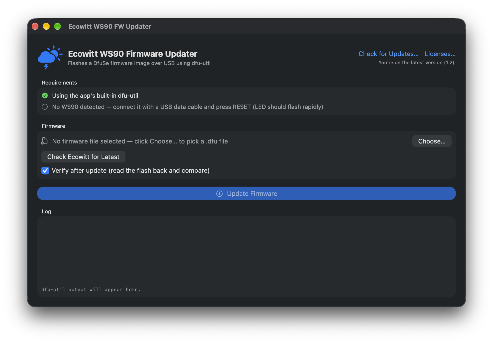

# Ecowitt WS90 FW Updater

A macOS app for updating [Ecowitt WS90](https://www.ecowitt.com) (and WS80) weather station firmware over USB — no Terminal, no Homebrew, no Windows-only tools.

## Download

Grab the latest signed and notarized build from the [Releases page](https://github.com/cnetterville/ecowitt-ws90-fw-updater/releases/latest). Unzip and drag to Applications.

## Features

- **Automatic device detection** — plug the station in and the app finds it, showing its serial number and flash layout.
- **One-click firmware fetch** — checks Ecowitt's site for the newest published WS90 firmware and downloads it for you; you can also choose a `.dfu` file manually.
- **Verify after update** — optionally reads the flash back after writing and compares it byte-for-byte against the firmware file.
- **Safe by design** — validates firmware files before flashing, prevents your Mac from sleeping mid-update, confirms before canceling, and gives specific recovery guidance if anything fails.
- **Self-contained** — bundles `dfu-util` and `libusb`, so there's nothing else to install.

## Usage

1. Remove the silicone cover from the top of the station and connect it to your Mac with a Micro-USB **data** cable (charge-only cables won't work).
2. Press the **RESET** button — the LED should flash rapidly, indicating DFU mode. The app detects the station within a couple of seconds.
3. Click **Check Ecowitt for Latest** → **Download & Use**, or **Choose…** to pick a `.dfu` file you downloaded yourself.
4. Click **Update Firmware** and leave the cable alone until it finishes.
5. Disconnect the cable and press **RESET**. The LED stays on for a few seconds and then turns off — the station is back to normal operation.

If an update fails partway, don't worry: the bootloader lives in protected memory and can't be damaged. Press RESET to re-enter DFU mode and run the update again.

## How it works

The WS90's microcontroller ships with the standard STM32 DFU bootloader (`0483:df11`). The app drives a bundled copy of [dfu-util](https://dfu-util.sourceforge.net) to download the DfuSe firmware image to the device, using the 512-byte transfer size from Ecowitt's official update guide (the bootloader mishandles erases at the default size). Firmware files are parsed and validated as DfuSe images before flashing, and the same parser powers the optional read-back verification.

## Building from source

Open `Ecowitt WS90 FW Updater.xcodeproj` in Xcode and build. The bundled `dfu-util`/`libusb` binaries are included in the repo. `scripts/make-release.sh` produces a signed, notarized release build (requires a Developer ID certificate and stored `notarytool` credentials — see the script header).

## Licenses

The app bundles two free-software components, invoked as separate helper processes:

- [dfu-util](https://dfu-util.sourceforge.net) 0.11 — GPL-2.0-or-later
- [libusb](https://libusb.info) 1.0.30 — LGPL-2.1-or-later

Full license texts are available via the **Licenses…** button in the app, and the complete corresponding source code is attached to every [release](https://github.com/cnetterville/ecowitt-ws90-fw-updater/releases) (also in [`ThirdPartySources/`](ThirdPartySources/)).

## Disclaimer

This is an unofficial tool, not affiliated with Ecowitt. Flashing firmware is done at your own risk — though the WS90's protected bootloader makes it hard to get into real trouble. Always use firmware for your exact device model.
